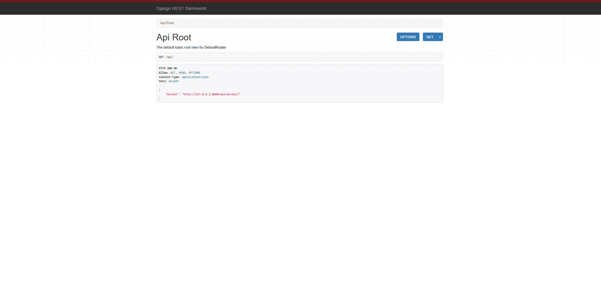
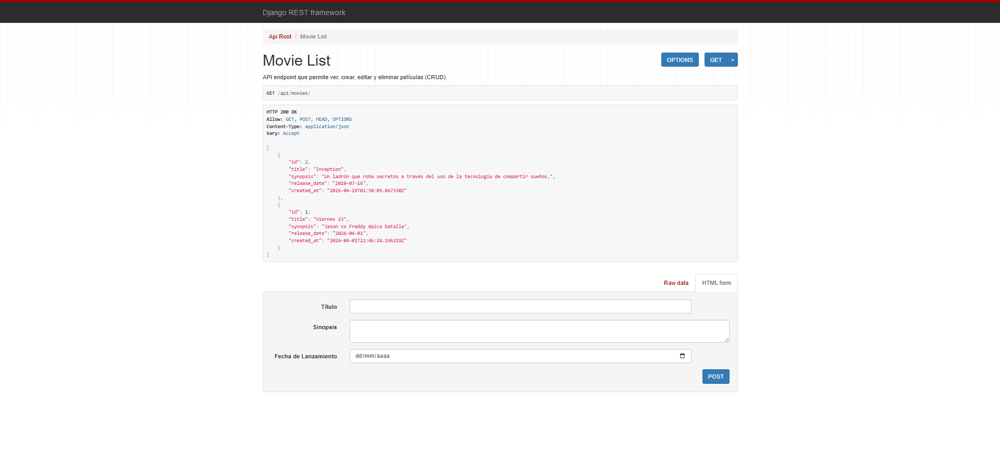
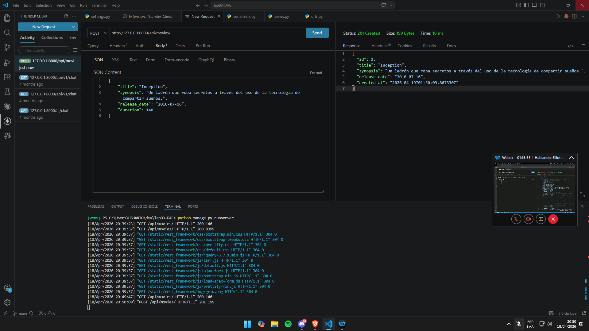
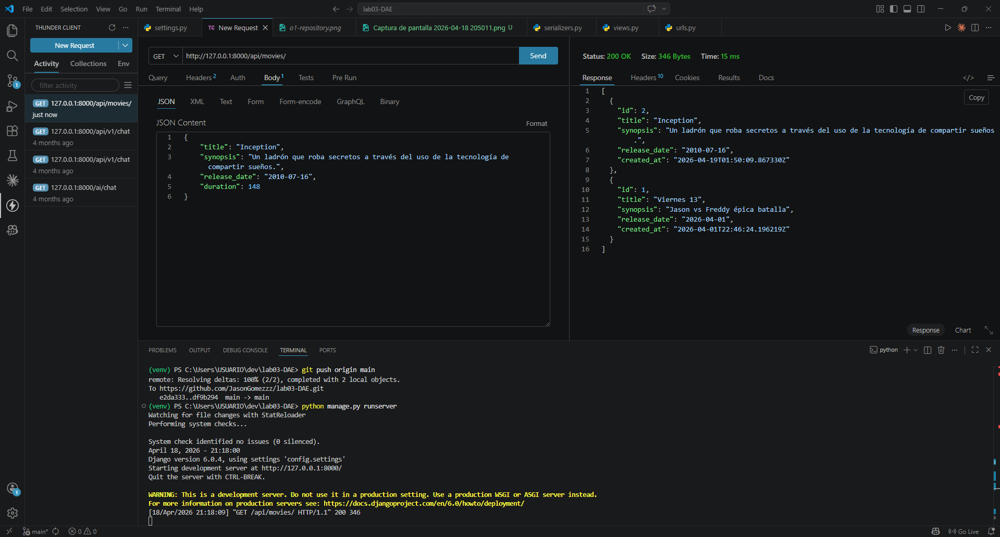
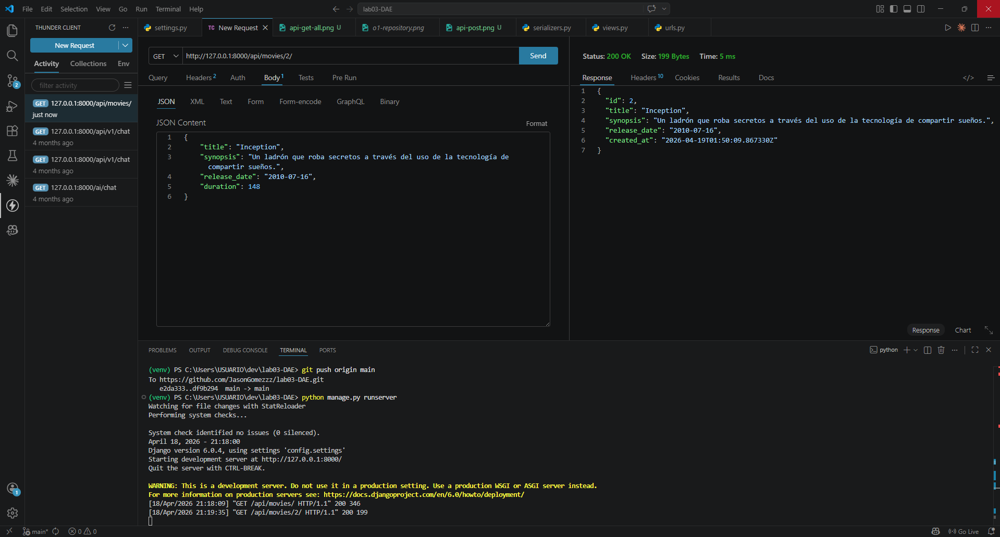
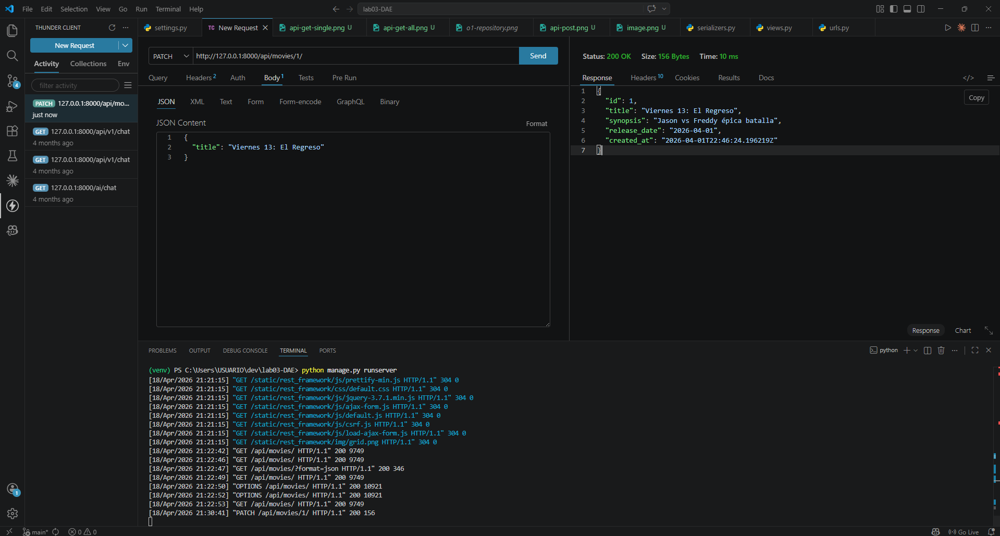
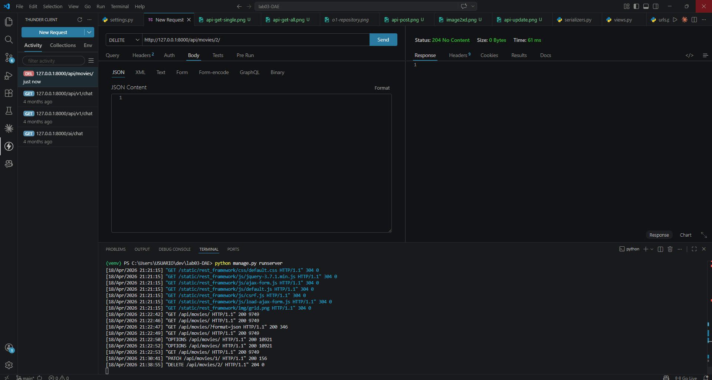
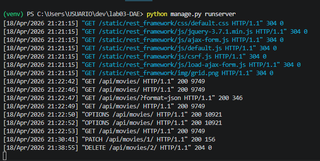

# 🎬 CINESPOILERS - API RESTFUL PROFESIONAL
**Desarrollador:** Jason Gomez Mancha  
**Especialidad:** Diseño y Desarrollo de Software (Tecsup)

---

## 📡 Fase 2: Documentación de la API (Actual)
Evolución a servicios web con **Django Rest Framework**. A continuación, se detalla la estructura y el ciclo CRUD verificado.

### 🌐 Interfaz Navegable (Browsable API)
La API cuenta con una interfaz web autogenerada para facilitar la inspección de recursos.
* **API Root:** Punto de entrada principal.
    
* **API Movie List:** Vista de lista desde el navegador.
    

---

### 📊 Tabla de Operaciones CRUD (Thunder Client)
| Operación | Método | Endpoint | Evidencia Visual |
| :--- | :---: | :--- | :--- |
| **CREATE** | `POST` | `/api/movies/` |  |
| **READ ALL** | `GET` | `/api/movies/` |  |
| **READ ONE** | `GET` | `/api/movies/2/` |  |
| **UPDATE** | `PATCH`| `/api/movies/1/` |  |
| **DELETE** | `DELETE`| `/api/movies/2/` |  |

---

### 🖥️ Registro Técnico y Logs
Evidencia de las peticiones procesadas (Status 200, 201 y 204) en la terminal del servidor.


---

## 🏗️ Fase 1: Estructura y Base del Proyecto
Historial de la construcción inicial del entorno y administración.

### 1. Preparación del Entorno


### 2. Levantamiento y Admin


---

## 🚀 Guía de Instalación Rápida
```bash
# 1. Activar entorno virtual
.\venv\Scripts\activate

# 2. Instalar dependencias
pip install -r requirements.txt

# 3. Correr el servidor
python manage.py runserver