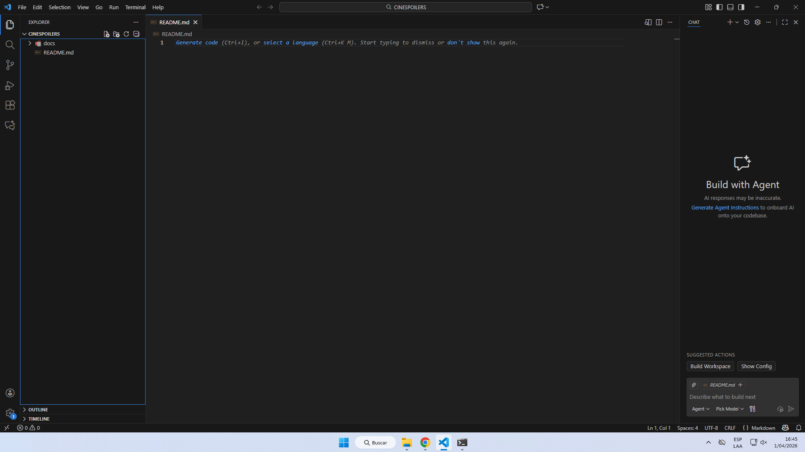
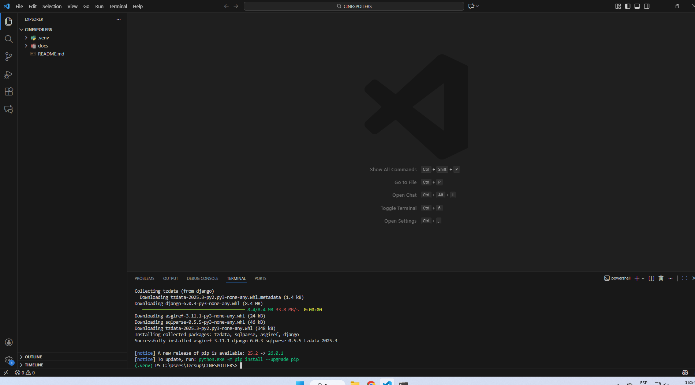
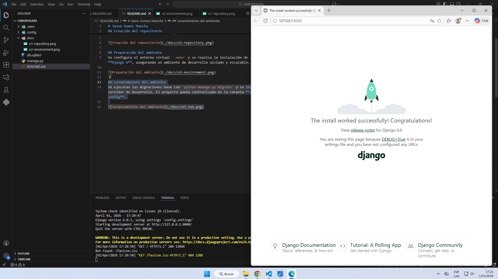
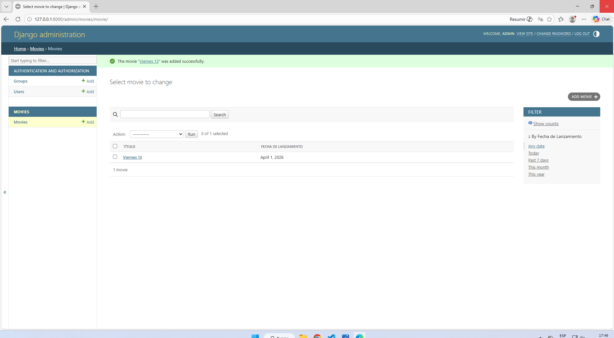

# Jason Gomez Mancha

## Creación del repositorio
Se inicializa el repositorio con la carpeta raíz **CINESPOILERS**, organizando los recursos multimedia en la carpeta **/docs**.

## Preparación del ambiente
Se configura el entorno virtual `.venv` y se realiza la instalación de **Django 6**, asegurando un ambiente de desarrollo aislado y escalable.

## Levantamiento del ambiente
Se ejecutan las migraciones base con `python manage.py migrate` y se inicia el servidor de desarrollo. El proyecto queda centralizado en la carpeta **/config**.

## Admin de la nueva Aplicación Movies
Se habilitó la interfaz administrativa para el modelo `Movie`. Se configuró la clase `MovieAdmin` con visualización de columnas, buscador dinámico y filtros laterales para una gestión eficiente del catálogo.

